# PETMATCH RESCUE - ENTREGA 1

## Descripción

PetMatch Rescue es una aplicación de escritorio desarrollada en Java que permite registrar y gestionar reportes de mascotas perdidas o encontradas. En esta primera entrega se implementaron tres estructuras de datos lineales dinámicas: lista doblemente enlazada, pila y cola de prioridad.

---

# Funcionalidades Implementadas

* Registro de reportes de mascotas.
* Búsqueda de reportes por ID.
* Eliminación de reportes.
* Visualización de reportes registrados.
* Gestión de alertas urgentes.
* Historial de acciones realizadas.

---

# Evidencias

## Interfaz Principal

La aplicación cuenta con una interfaz gráfica que permite acceder a los módulos de reportes, alertas urgentes e historial.

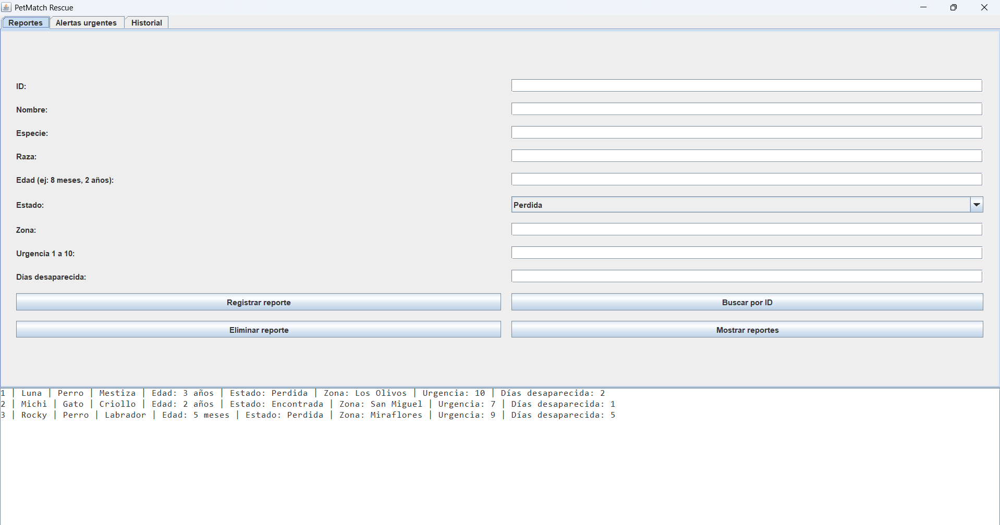

---

## Registro de Reporte

Se registró una nueva mascota dentro del sistema utilizando el formulario de reportes.

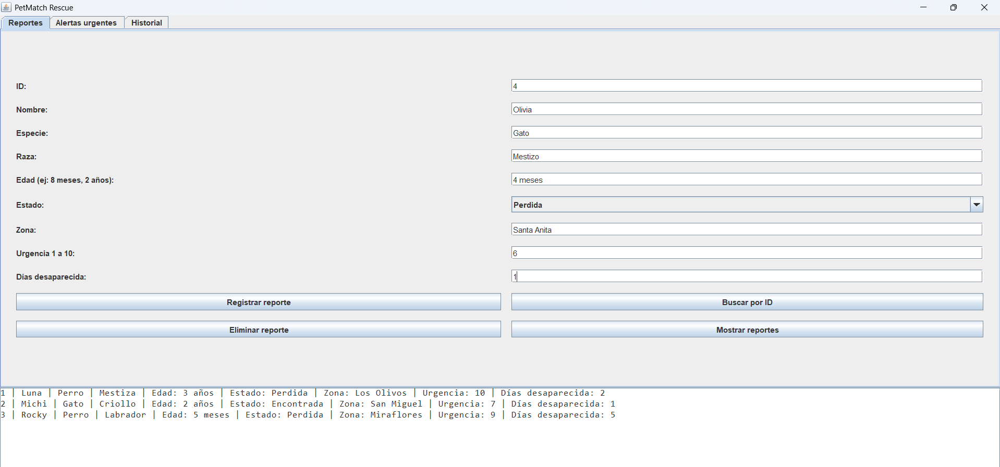

---

## Lista Doblemente Enlazada

La lista doblemente enlazada se utiliza para almacenar los reportes de mascotas registrados. La siguiente captura muestra los reportes almacenados en la estructura.

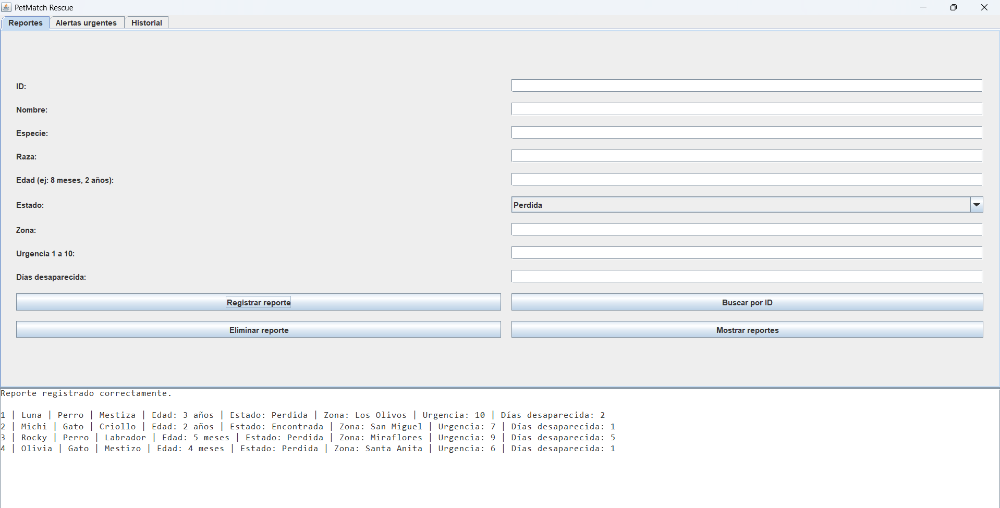

---

## Búsqueda de Reporte

Se realizó la búsqueda de una mascota mediante su identificador único (ID).

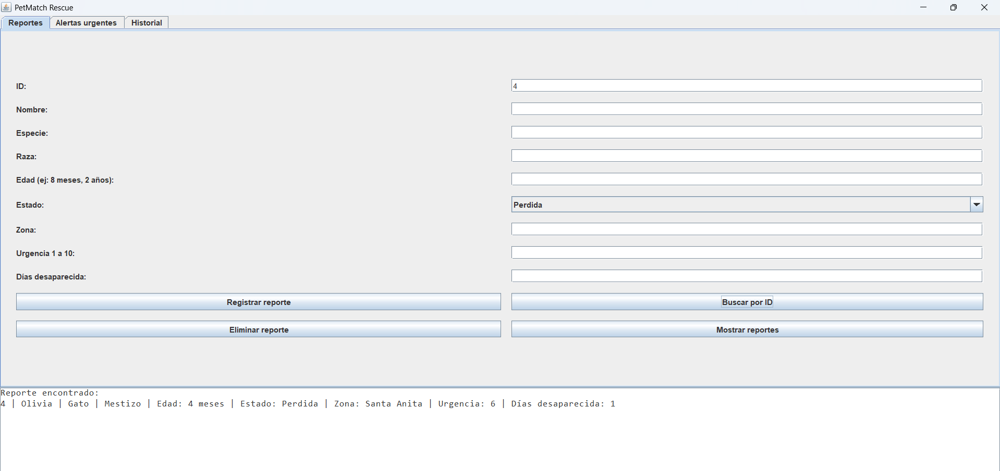

---

## Eliminación de Reporte

Se eliminó un reporte previamente registrado dentro del sistema.

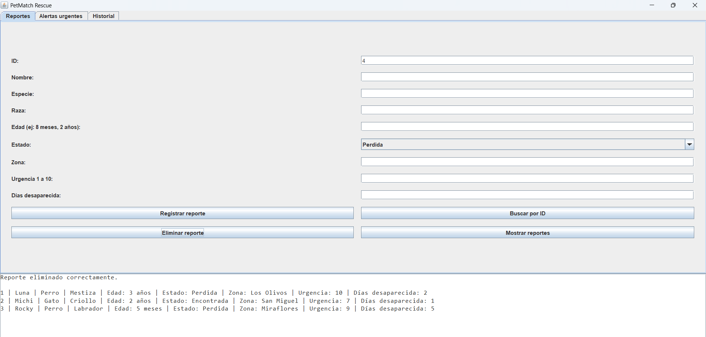

---

## Cola de Prioridad

La cola de prioridad se utiliza para gestionar alertas urgentes. Las alertas con mayor prioridad son atendidas antes que las demás.

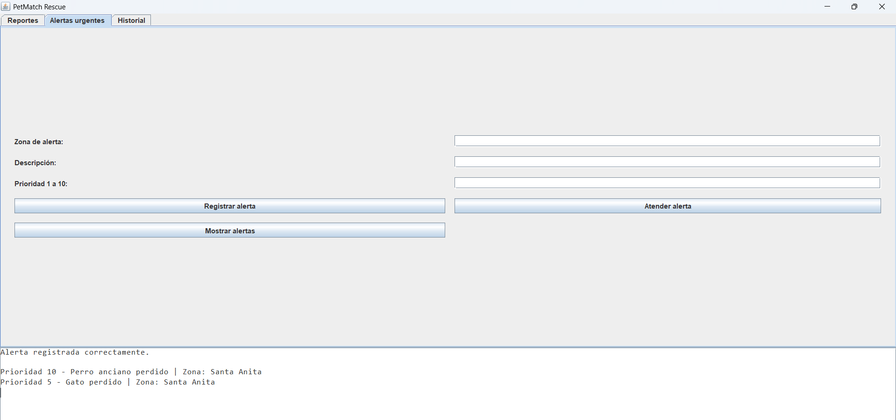

---

## Pila de Acciones

La pila se utiliza para almacenar el historial de acciones realizadas dentro del sistema.

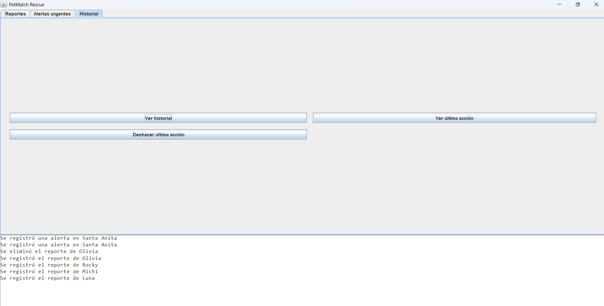

---

# Estructuras Implementadas

| Estructura                | Uso dentro del sistema          |
| ------------------------- | ------------------------------- |
| Lista Doblemente Enlazada | Almacenar reportes de mascotas  |
| Pila                      | Registrar historial de acciones |
| Cola de Prioridad         | Gestionar alertas urgentes      |

---

# Avance Entrega 2

Durante la segunda entrega se incorporaron estructuras de datos no lineales, algoritmos de ordenamiento y conceptos adicionales de Programación Orientada a Objetos.

## Árbol Binario de Búsqueda

El árbol binario se utiliza para realizar búsquedas rápidas de reportes mediante su identificador único (ID).

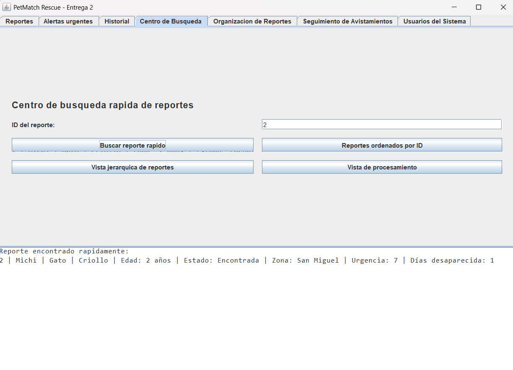

---

## Recorrido InOrder

Se implementó el recorrido InOrder para visualizar los reportes organizados por ID.

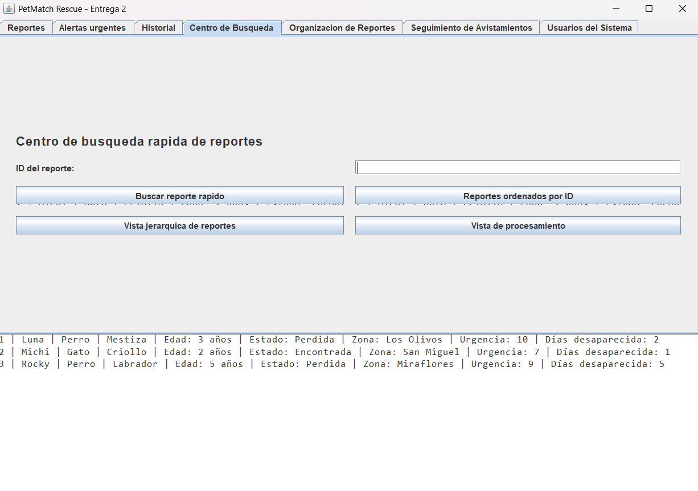

---

## Quick Sort

Quick Sort permite ordenar los reportes según el nivel de urgencia de cada caso.

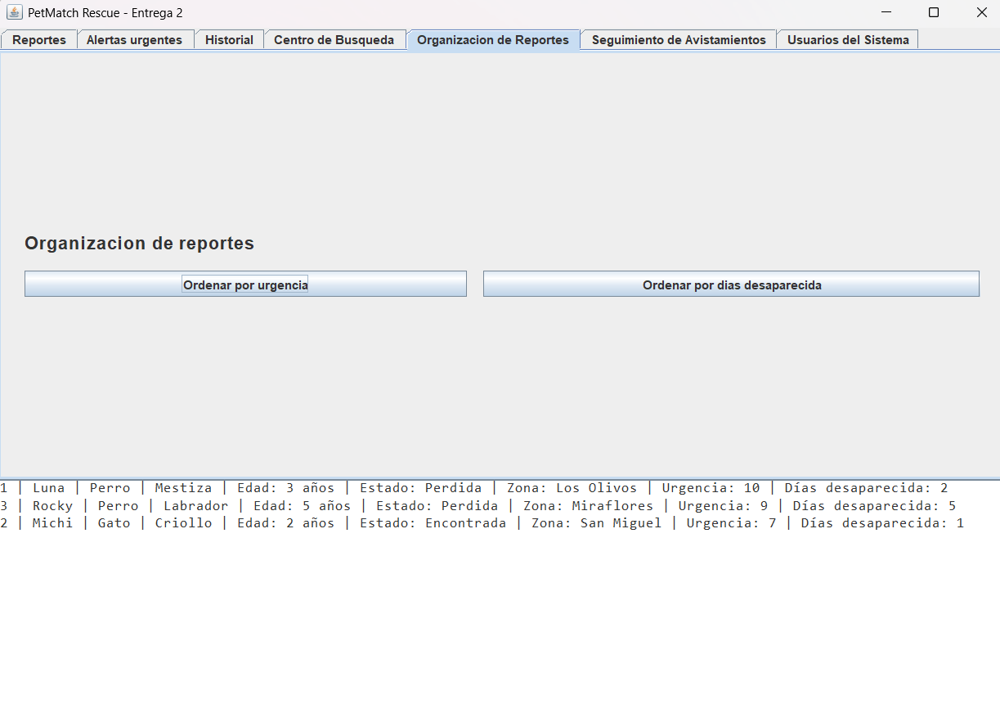

---

## Insertion Sort

Insertion Sort permite ordenar los reportes según los días que la mascota lleva desaparecida.

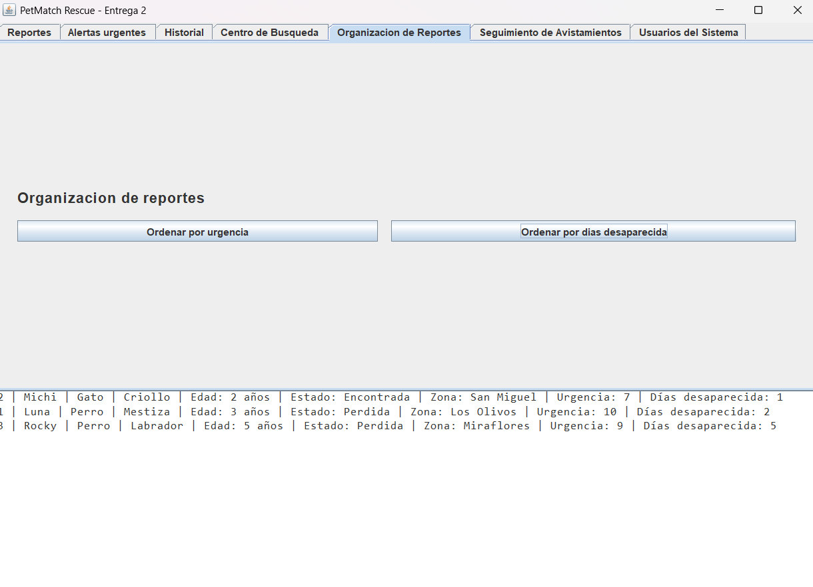

---

## Seguimiento de Avistamientos

Se implementó un grafo para registrar avistamientos realizados por diferentes usuarios y generar una ruta probable de desplazamiento de la mascota.

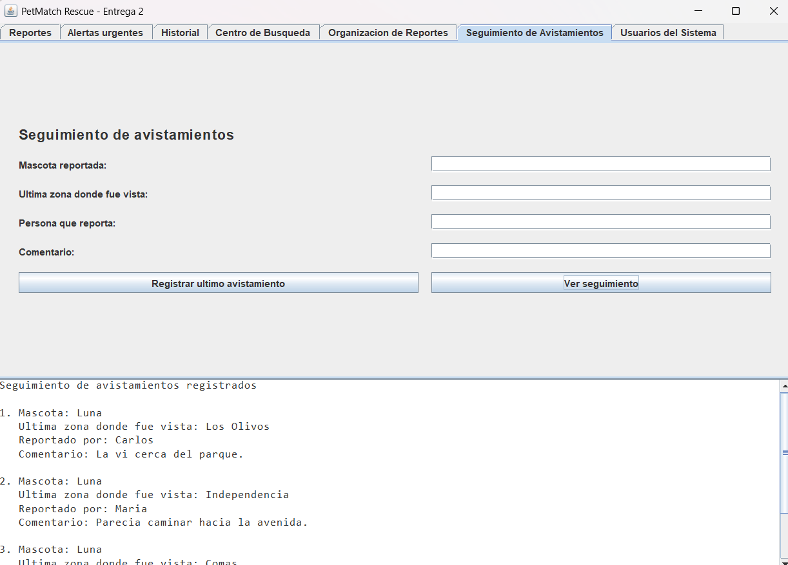

---

## Herencia de Usuarios

Se implementó una jerarquía de usuarios utilizando herencia mediante una clase padre Usuario y las clases hijas Reportante, Voluntario y Administrador.

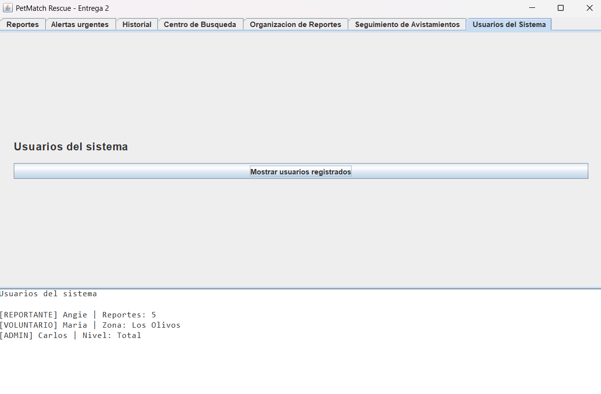

---

# Estructuras y Algoritmos Implementados

| Elemento | Clase | Uso dentro del sistema |
|---|---|---|
| Lista doblemente enlazada | ListaDobleMascotas | Almacenar reportes de mascotas |
| Pila | PilaAcciones | Registrar historial de acciones |
| Cola de prioridad | ColaPrioridadAlertas | Gestionar alertas urgentes |
| Árbol binario de búsqueda | ArbolMascotas | Buscar reportes rápidamente por ID |
| Grafo | GrafoZonas | Registrar seguimiento de avistamientos |
| Quick Sort | Ordenamientos | Ordenar reportes por urgencia |
| Insertion Sort | Ordenamientos | Ordenar reportes por días desaparecida |
| Herencia | Usuario, Reportante, Voluntario, Administrador | Representar tipos de usuarios del sistema |

---

# Estructura del Proyecto

```text
src
├── models
│   ├── Mascota.java
│   ├── Usuario.java
│   ├── Reportante.java
│   ├── Voluntario.java
│   └── Administrador.java
│
├── services
│   └── PetMatchService.java
│
├── structures
│   ├── NodoMascota.java
│   ├── ListaDobleMascotas.java
│   ├── PilaAcciones.java
│   ├── ColaPrioridadAlertas.java
│   ├── ArbolMascotas.java
│   └── GrafoZonas.java
│
├── sorting
│   └── Ordenamientos.java
│
├── ui
│   └── PetMatchFrame.java
│
└── Main.java

---
